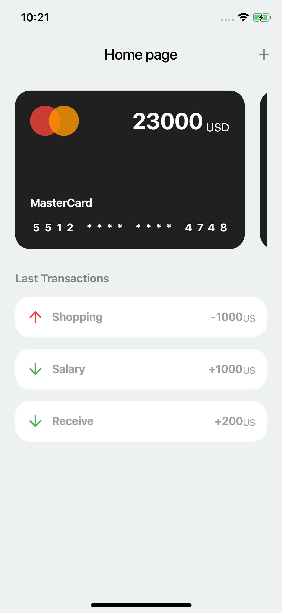
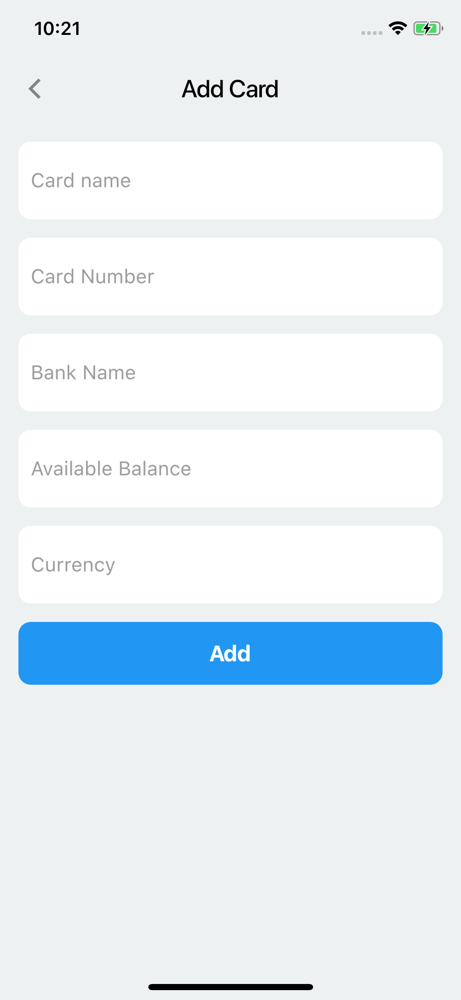
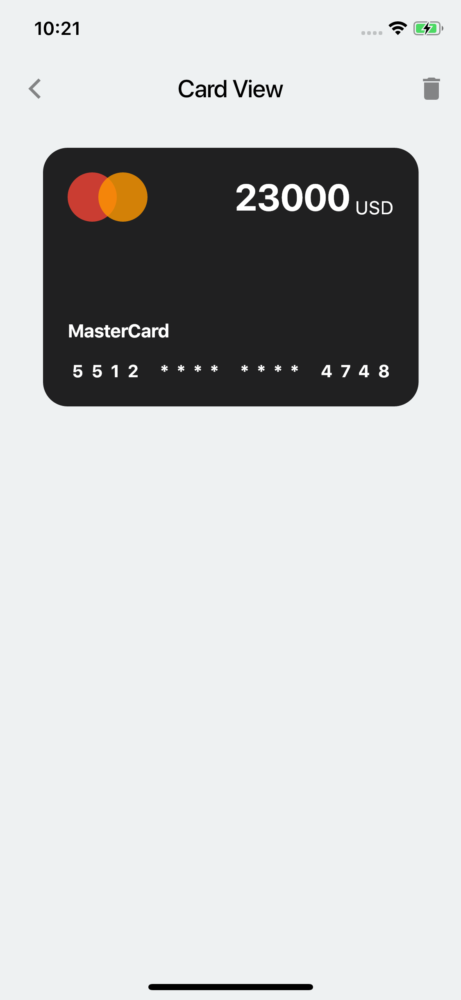

# Flutter Expense Tracker Application

This is an Expense Tracker app built with Flutter. It allows users to easily track their expenses and manage their budget. The app provides a user-friendly interface for adding, editing, and deleting expenses, as well as viewing expense summaries and generating reports.

## Features

- **Expense Logging:** Users can log their expenses by entering the amount, category, date, and optional notes. The app supports various expense categories such as groceries, transportation, entertainment, etc.

- **Expense Editing and Deletion:** Users can easily edit or delete their expenses if they made a mistake or want to update the information.

- **Expense Summary:** The app provides a summary of the total expenses, categorized expenses, and an overview of expenses over time. Users can quickly get an idea of their spending habits.

- **Expense Filtering and Sorting:** Users can filter and sort expenses based on different criteria like date, category, or amount. This allows for easier navigation and analysis of expenses.

- **Budget Management:** Users can set a monthly budget and track their expenses against it. The app provides visual indicators to show users whether they are within budget or exceeding it.

- **Reports and Analytics:** The app generates detailed reports and analytics to help users gain insights into their spending patterns. Users can view graphical representations of their expenses, compare month-to-month spending, and identify areas for improvement.

## Screenshot

